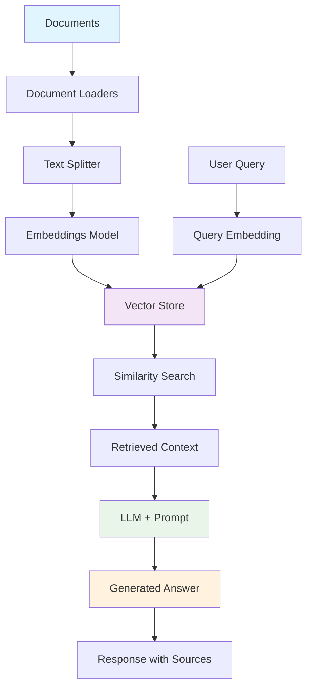

# RAG (Retrieval-Augmented Generation) System Tutorial

<div align="center">
  
  <h1 align="center">RAG System with LangChain & Mistral<br/>Complete Implementation Guide</h1>
</div>

<div align="center">
  <a href="#"></a>
  <a href="#"></a>
  <a href="#"></a>
  <a href="#"></a>
  <a href="#"></a>
  <a href="#"></a>
  <hr>
</div>

## Table of Contents
1. [What is RAG?](#what-is-rag)
2. [RAG Architecture](#rag-architecture)
3. [Implementation Components](#implementation-components)
4. [Quick Start](#quick-start)
5. [File Structure](#file-structure)
6. [Detailed Walkthrough](#detailed-walkthrough)
7. [Advanced Features](#advanced-features)
8. [Evaluation and Testing](#evaluation-and-testing)
9. [Production Deployment](#production-deployment)
10. [Troubleshooting](#troubleshooting)

---

## What is RAG?

**RAG (Retrieval-Augmented Generation)** is a powerful technique that combines information retrieval with language generation to create more accurate, up-to-date, and contextually relevant AI responses.

### Key Benefits:
- 📚 **Access to External Knowledge**: Goes beyond LLM training data
- 🎯 **Reduced Hallucination**: Responses grounded in actual documents
- 🔍 **Source Attribution**: Transparent citations for answers
- 🔄 **Dynamic Updates**: Knowledge base can be updated without retraining
- 🏢 **Domain-Specific**: Perfect for internal company knowledge

### How RAG Works:
1. **Ingestion**: Load and process documents
2. **Indexing**: Create searchable embeddings
3. **Retrieval**: Find relevant content for queries
4. **Generation**: LLM generates answers using retrieved context
5. **Response**: Return answer with source citations

---

## RAG Architecture



---

## Implementation Components

### Core Dependencies
```python
langchain-mistralai      # Mistral LLM integration
langchain-community      # Document loaders and utilities
faiss-cpu               # Vector database for similarity search
sentence-transformers   # Embedding models
pypdf                   # PDF document processing
python-docx             # Word document processing
jq                      # JSON processing (optional, has fallback)
```

### Key Classes Used
- **Document Loaders**: `TextLoader`, `PyPDFLoader`, `Docx2txtLoader`
- **Text Splitters**: `RecursiveCharacterTextSplitter`
- **Embeddings**: `HuggingFaceEmbeddings`
- **Vector Store**: `FAISS`
- **Chains**: `RetrievalQA`, `ConversationalRetrievalChain`

---

## Quick Start

### Prerequisites
1. Python 3.8+
2. Mistral API key (get from [Mistral AI](https://console.mistral.ai/))
3. VS Code with Jupyter extension (recommended)

### Installation
```bash
# Clone the repository
git clone <repository-url>
cd ai_agents_tutorials

# Install dependencies
pip install -r requirements.txt

# Set up environment variables
cp .env.example .env
# Edit .env and add your MISTRAL_API_KEY
```

### Run the Notebook
1. Open `langchain_mistral_rag_demo.ipynb` in VS Code
2. Run all cells sequentially
3. The system will create sample documents if none exist
4. Test with your own documents by placing them in the `knowledgebase/` folder

---

## File Structure

```
ai_agents_tutorials/
├── langchain_mistral_rag_demo.ipynb    # Main RAG implementation
├── README_RAG.md                       # This file
├── requirements.txt                    # Python dependencies
├── .env.example                        # Environment variables template
├── knowledgebase/                      # Document storage
│   ├── sample.txt                      # Auto-generated sample text
│   ├── sample.json                     # Auto-generated sample JSON
│   └── (your documents here)           # Add your own files
└── assets/
    └── ai_agents_logo.svg              # Project logo
```

---

## Detailed Walkthrough

### 1. Document Loading (Section 3)
The system supports multiple document formats:
- **Text files** (`.txt`): Plain text documents
- **PDF files** (`.pdf`): Extracted text content
- **Word documents** (`.docx`): Text extraction
- **JSON files** (`.json`): Structured data
- **CSV files** (`.csv`): Tabular data

### 2. Text Splitting (Section 4)
Documents are split into chunks for better retrieval:
- **Chunk size**: 1000 characters (configurable)
- **Overlap**: 200 characters (preserves context)
- **Splitting strategy**: Paragraphs → Lines → Words

### 3. Embeddings (Section 5)
Text chunks are converted to vectors:
- **Model**: `sentence-transformers/all-MiniLM-L6-v2`
- **Dimension**: 384 (balanced speed/accuracy)
- **Storage**: FAISS vector database

### 4. Retrieval (Section 6)
Query processing and document retrieval:
- **Search type**: Semantic similarity
- **Top-k**: 4 most relevant chunks
- **Scoring**: Cosine similarity

### 5. Generation (Section 7-8)
LLM generates answers using retrieved context:
- **Model**: Mistral (configurable)
- **Prompt**: Custom RAG template
- **Output**: Answer + source citations

---

## Advanced Features

### Conversational RAG (Section 9)
- **Memory**: Maintains conversation history
- **Context**: References previous exchanges
- **Chain type**: `ConversationalRetrievalChain`

### Custom Prompts
```python
rag_prompt_template = """
You are a helpful assistant that answers questions based on the provided context.
Use the following pieces of context to answer the question at the end.
If you don't know the answer based on the context, just say that you don't know.

Context: {context}
Question: {question}
Answer:"""
```

### Interactive Functions
- `ask_question()`: Single-turn Q&A
- `chat_with_rag()`: Multi-turn conversation
- `test_rag_system()`: Comprehensive testing

---

## Evaluation and Testing

### Built-in Testing
The notebook includes comprehensive testing functions:
```python
# Test various question types
test_questions = [
    "What are AI agents?",
    "What are the different types of AI agents?",
    "What capabilities does Mistral have?",
    "What are the components of RAG?",
    "How do AI agents perceive their environment?"
]
```

### Evaluation Metrics
Consider implementing:
- **Retrieval Accuracy**: Precision/Recall of relevant documents
- **Answer Quality**: BLEU, ROUGE scores
- **Faithfulness**: Answer adherence to source material
- **Relevance**: Context appropriateness

### Recommended Tools
- **RAGAS**: RAG evaluation framework
- **TruLens**: LLM evaluation and monitoring
- **LangSmith**: LangChain monitoring and debugging

---

## Production Deployment

### Performance Optimization
1. **Embeddings**: Use GPU acceleration for large datasets
2. **Vector Store**: Consider Pinecone/Weaviate for scale
3. **Caching**: Implement Redis for frequent queries
4. **Async**: Use async processing for concurrent requests

### Scaling Considerations
```python
# Example production configuration
embeddings = HuggingFaceEmbeddings(
    model_name="sentence-transformers/all-MiniLM-L6-v2",
    model_kwargs={'device': 'cuda'},  # GPU acceleration
    encode_kwargs={'batch_size': 32}  # Batch processing
)
```

### API Wrapper Example
```python
from fastapi import FastAPI
from pydantic import BaseModel

app = FastAPI()

class Query(BaseModel):
    question: str

@app.post("/ask")
async def ask_question(query: Query):
    result = rag_chain.invoke({"query": query.question})
    return {
        "answer": result["result"],
        "sources": [doc.metadata for doc in result["source_documents"]]
    }
```

---

## Troubleshooting

### Common Issues

#### 1. Memory Issues
```bash
# If you get OOM errors
pip install faiss-cpu  # Instead of faiss-gpu
# Reduce chunk size and batch size
```

#### 2. Slow Embeddings
```python
# Use smaller embedding model
embeddings = HuggingFaceEmbeddings(
    model_name="sentence-transformers/all-MiniLM-L6-v2"  # Faster
    # Instead of "sentence-transformers/all-mpnet-base-v2"  # Slower but better
)
```

#### 3. Poor Retrieval Quality
```python
# Adjust retrieval parameters
retriever = vector_store.as_retriever(
    search_type="similarity",
    search_kwargs={"k": 6}  # Increase retrieved chunks
)
```

#### 4. Document Loading Errors
```python
# Add error handling
try:
    docs = loader.load()
except Exception as e:
    print(f"Error loading {file_path}: {e}")
    continue
```

#### 5. JSON Loading Issues
```bash
# If you get "jq package not found" error
pip install jq

# Or the system will automatically fallback to simple JSON loading
# Warning: Simple JSON loading may not extract all nested content
```

### Debug Tips
1. **Check embeddings**: Verify vector store creation
2. **Test retrieval**: Use `similarity_search()` directly
3. **Inspect chunks**: Examine document splitting results
4. **Monitor tokens**: Track LLM input/output lengths

---

## Example Use Cases

### 1. Internal Knowledge Base
```python
# Load company documents
documents = load_documents_from_directory("company_docs/")
# Answer employee questions
ask_question("What is our vacation policy?")
```

### 2. Research Assistant
```python
# Load research papers
documents = load_documents_from_directory("research_papers/")
# Get insights
ask_question("What are the latest findings on transformer architectures?")
```

### 3. Customer Support
```python
# Load product manuals
documents = load_documents_from_directory("product_docs/")
# Answer customer queries
ask_question("How do I reset my password?")
```

---

## Next Steps

### Enhancements to Consider
1. **Multi-modal RAG**: Add image and audio support
2. **Hybrid Search**: Combine semantic + keyword search
3. **Agent Integration**: Use RAG as a tool in agent workflows
4. **Real-time Updates**: Implement document change monitoring
5. **Advanced Chunking**: Semantic-aware text splitting

### Related Notebooks
- `langchain_mistral_agent_demo.ipynb`: Basic agent implementation
- `agent_reasoning_tool_use_demo.ipynb`: Advanced reasoning patterns

---

## Contributing

1. Fork the repository
2. Create a feature branch
3. Make your changes
4. Add tests and documentation
5. Submit a pull request

---

## License

This project is licensed under the MIT License - see the LICENSE file for details.

---

## Acknowledgments

- **LangChain**: For the excellent RAG framework
- **Mistral AI**: For the powerful language models
- **Hugging Face**: For the embedding models
- **FAISS**: For efficient similarity search

---

<div align="center">
  <p>Built with ❤️ for the AI community</p>
  <p>⭐ Star this repo if you found it helpful!</p>
</div>
