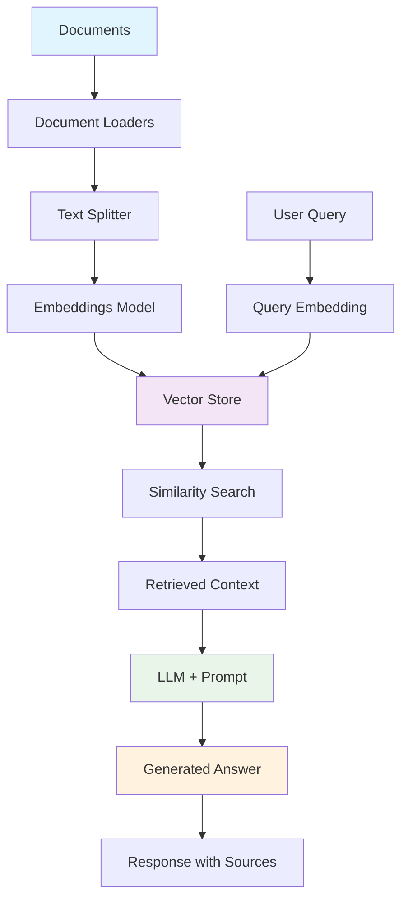

# RAG (Retrieval-Augmented Generation) System Tutorial

<div align="center">
  
  <h1 align="center">RAG System with LangChain & Mistral<br/>Complete Implementation Guide</h1>
</div>

<div align="center">
  <a href="#"></a>
  <a href="#"></a>
  <a href="#"></a>
  <a href="#"></a>
  <a href="#"></a>
  <a href="#"></a>
  <hr>
</div>

## Table of Contents
1. [What is RAG?](#what-is-rag)
2. [RAG Architecture](#rag-architecture)
3. [Implementation Components](#implementation-components)
4. [Quick Start](#quick-start)
5. [File Structure](#file-structure)
6. [Detailed Walkthrough](#detailed-walkthrough)
7. [Advanced Features](#advanced-features)
8. [Evaluation and Testing](#evaluation-and-testing)
9. [Production Deployment](#production-deployment)
10. [Troubleshooting](#troubleshooting)

---

## What is RAG?

**RAG (Retrieval-Augmented Generation)** is a powerful technique that combines information retrieval with language generation to create more accurate, up-to-date, and contextually relevant AI responses.

### Key Benefits:
- 📚 **Access to External Knowledge**: Goes beyond LLM training data
- 🎯 **Reduced Hallucination**: Responses grounded in actual documents
- 🔍 **Source Attribution**: Transparent citations for answers
- 🔄 **Dynamic Updates**: Knowledge base can be updated without retraining
- 🏢 **Domain-Specific**: Perfect for internal company knowledge

### How RAG Works:
1. **Ingestion**: Load and process documents
2. **Indexing**: Create searchable embeddings
3. **Retrieval**: Find relevant content for queries
4. **Generation**: LLM generates answers using retrieved context
5. **Response**: Return answer with source citations

---

## RAG Architecture



---

## Implementation Components

### Core Dependencies
```python
langchain-mistralai      # Mistral LLM integration
langchain-community      # Document loaders and utilities
faiss-cpu               # Vector database for similarity search
sentence-transformers   # Embedding models
pypdf                   # PDF document processing
python-docx             # Word document processing
jq                      # JSON processing (optional, has fallback)
```

### Key Classes Used
- **Document Loaders**: `TextLoader`, `PyPDFLoader`, `Docx2txtLoader`
- **Text Splitters**: `RecursiveCharacterTextSplitter`
- **Embeddings**: `HuggingFaceEmbeddings`
- **Vector Store**: `FAISS`
- **Chains**: `RetrievalQA`, `ConversationalRetrievalChain`

---

## Quick Start

### Prerequisites
1. Python 3.8+
2. Mistral API key (get from [Mistral AI](https://console.mistral.ai/))
3. VS Code with Jupyter extension (recommended)

### Installation
```bash
# Clone the repository
git clone <repository-url>
cd ai_agents_tutorials

# Install dependencies
pip install -r requirements.txt

# Set up environment variables
cp .env.example .env
# Edit .env and add your MISTRAL_API_KEY
```

### Run the Notebook
1. Open `langchain_mistral_rag_demo.ipynb` in VS Code
2. Run all cells sequentially
3. The system will create sample documents if none exist
4. Test with your own documents by placing them in the `knowledgebase/` folder

---

## File Structure

```
ai_agents_tutorials/
├── langchain_mistral_rag_demo.ipynb    # Main RAG implementation
├── README.md                       # This file
├── requirements.txt                    # Python dependencies
├── .env.example                        # Environment variables template
├── knowledgebase/                      # Document storage
│   ├── sample.txt                      # Auto-generated sample text
│   ├── sample.json                     # Auto-generated sample JSON
│   └── (your documents here)           # Add your own files
└── assets/
    └── ai_agents_logo.svg              # Project logo
```

---

## Detailed Walkthrough

### 1. Document Loading (Section 3) - Deep Dive

Document loading is the foundation of any RAG system. Our implementation supports multiple formats and provides robust error handling.

#### Supported Document Types

**Text Files (`.txt`)**
```python
from langchain_community.document_loaders import TextLoader
loader = TextLoader("document.txt", encoding="utf-8")
documents = loader.load()
```
- **Best for**: Plain text documents, documentation, transcripts
- **Metadata**: File path, creation time
- **Considerations**: Ensure proper encoding (UTF-8 recommended)

**PDF Files (`.pdf`)**
```python
from langchain_community.document_loaders import PyPDFLoader
loader = PyPDFLoader("document.pdf")
documents = loader.load()  # Each page becomes a separate document
```
- **Best for**: Research papers, reports, manuals
- **Metadata**: Page numbers, file path
- **Considerations**: OCR quality affects text extraction; complex layouts may need preprocessing

**Word Documents (`.docx`)**
```python
from langchain_community.document_loaders import Docx2txtLoader
loader = Docx2txtLoader("document.docx")
documents = loader.load()
```
- **Best for**: Business documents, reports, templates
- **Metadata**: File path, document properties
- **Considerations**: Formatting is lost; tables may need special handling

**JSON Files (`.json`)**
```python
from langchain_community.document_loaders import JSONLoader
# Method 1: With jq (recommended)
loader = JSONLoader("data.json", jq_schema='.content', text_content=False)
# Method 2: Simple loading (fallback)
loader = JSONLoader("data.json")
documents = loader.load()
```
- **Best for**: Structured data, API responses, configuration files
- **Metadata**: JSON keys, nested structure info
- **Considerations**: Use `jq_schema` to extract specific fields

**CSV Files (`.csv`)**
```python
from langchain_community.document_loaders import CSVLoader
loader = CSVLoader("data.csv", csv_args={'delimiter': ','})
documents = loader.load()  # Each row becomes a document
```
- **Best for**: Tabular data, databases exports, spreadsheets
- **Metadata**: Row numbers, column headers
- **Considerations**: Each row becomes a separate document

#### Advanced Loading Strategies

**Batch Loading with Error Handling**
```python
def robust_document_loading(directory_path):
    """Enhanced document loading with comprehensive error handling"""
    documents = []
    failed_files = []
    
    file_loaders = {
        '.txt': TextLoader,
        '.pdf': PyPDFLoader,
        '.docx': Docx2txtLoader,
        '.json': JSONLoader,
        '.csv': CSVLoader
    }
    
    for file_path in Path(directory_path).glob('**/*'):  # Recursive search
        if file_path.suffix.lower() in file_loaders:
            try:
                loader_class = file_loaders[file_path.suffix.lower()]
                
                # Special handling for different file types
                if file_path.suffix.lower() == '.json':
                    loader = loader_class(str(file_path), jq_schema='.', text_content=False)
                elif file_path.suffix.lower() == '.csv':
                    loader = loader_class(str(file_path), encoding='utf-8')
                else:
                    loader = loader_class(str(file_path))
                
                docs = loader.load()
                
                # Add custom metadata
                for doc in docs:
                    doc.metadata.update({
                        'file_type': file_path.suffix.lower(),
                        'file_size': file_path.stat().st_size,
                        'load_timestamp': datetime.now().isoformat()
                    })
                
                documents.extend(docs)
                print(f"✅ Loaded {len(docs)} documents from {file_path.name}")
                
            except Exception as e:
                failed_files.append((str(file_path), str(e)))
                print(f"❌ Failed to load {file_path.name}: {e}")
    
    return documents, failed_files
```

**Custom Document Preprocessing**
```python
def preprocess_documents(documents):
    """Clean and preprocess documents before splitting"""
    processed = []
    
    for doc in documents:
        # Remove excessive whitespace
        content = re.sub(r'\s+', ' ', doc.page_content)
        
        # Remove special characters (optional)
        content = re.sub(r'[^\w\s\.\,\!\?\-\:]', '', content)
        
        # Skip empty documents
        if len(content.strip()) < 10:
            continue
            
        # Update document
        doc.page_content = content.strip()
        processed.append(doc)
    
    return processed
```

### 2. Text Splitting (Section 4) - Deep Dive

Text splitting is crucial for RAG performance. The goal is to create chunks that are:
- **Semantically coherent**: Related information stays together
- **Optimal size**: Not too small (lacks context) or too large (dilutes relevance)
- **Contextually aware**: Preserve important relationships

#### Splitting Strategies

**Recursive Character Text Splitter (Recommended)**
```python
from langchain.text_splitter import RecursiveCharacterTextSplitter

# Standard configuration
text_splitter = RecursiveCharacterTextSplitter(
    chunk_size=1000,           # Target chunk size in characters
    chunk_overlap=200,         # Overlap between chunks
    length_function=len,       # How to measure chunk length
    separators=["\n\n", "\n", " ", ""],  # Hierarchy of separators
    keep_separator=False       # Whether to keep separators in chunks
)
```

**How it works:**
1. **Try paragraph breaks** (`\n\n`) first
2. **Fall back to line breaks** (`\n`) if chunks too large
3. **Use spaces** (` `) as last resort
4. **Character-level splitting** if absolutely necessary

**Advanced Splitting Configurations**

```python
# For code documents
code_splitter = RecursiveCharacterTextSplitter(
    chunk_size=800,
    chunk_overlap=100,
    separators=["\n\n", "\nclass ", "\ndef ", "\n\n", "\n", " ", ""]
)

# For structured documents
structured_splitter = RecursiveCharacterTextSplitter(
    chunk_size=1200,
    chunk_overlap=300,
    separators=["\n# ", "\n## ", "\n### ", "\n\n", "\n", " ", ""]
)

# For conversational data
conversation_splitter = RecursiveCharacterTextSplitter(
    chunk_size=600,
    chunk_overlap=150,
    separators=["\n\n", "\nUser:", "\nAssistant:", "\n", " ", ""]
)
```

**Alternative Splitting Methods**

```python
# Token-based splitting (for precise token control)
from langchain.text_splitter import TokenTextSplitter
token_splitter = TokenTextSplitter(
    chunk_size=500,      # In tokens, not characters
    chunk_overlap=50,
    encoding_name="gpt2"  # Tokenizer to use
)

# Semantic splitting (experimental)
from langchain.text_splitter import SemanticChunker
semantic_splitter = SemanticChunker(
    embeddings=embeddings,
    breakpoint_threshold_type="percentile",
    breakpoint_threshold_amount=95
)
```

#### Chunk Optimization Strategies

**Dynamic Chunk Sizing**
```python
def adaptive_chunk_size(document_length):
    """Adjust chunk size based on document length"""
    if document_length < 5000:
        return 500, 100  # chunk_size, overlap
    elif document_length < 50000:
        return 1000, 200
    else:
        return 1500, 300

# Apply adaptive sizing
for doc in documents:
    chunk_size, overlap = adaptive_chunk_size(len(doc.page_content))
    splitter = RecursiveCharacterTextSplitter(
        chunk_size=chunk_size,
        chunk_overlap=overlap
    )
    chunks = splitter.split_documents([doc])
```

**Chunk Quality Assessment**
```python
def assess_chunk_quality(chunks):
    """Evaluate chunk quality metrics"""
    metrics = {
        'avg_length': sum(len(chunk.page_content) for chunk in chunks) / len(chunks),
        'length_variance': np.var([len(chunk.page_content) for chunk in chunks]),
        'empty_chunks': sum(1 for chunk in chunks if len(chunk.page_content.strip()) < 10),
        'total_chunks': len(chunks)
    }
    
    print(f"📊 Chunk Quality Metrics:")
    print(f"   Average length: {metrics['avg_length']:.0f} characters")
    print(f"   Length variance: {metrics['length_variance']:.0f}")
    print(f"   Empty chunks: {metrics['empty_chunks']}")
    print(f"   Total chunks: {metrics['total_chunks']}")
    
    return metrics
```

### 3. Embeddings (Section 5) - Deep Dive

Embeddings convert text into numerical vectors that capture semantic meaning. The quality of embeddings directly impacts retrieval performance.

#### Embedding Model Selection

**Sentence Transformers (Recommended)**
```python
from langchain_community.embeddings import HuggingFaceEmbeddings

# Fast and efficient (384 dimensions)
embeddings = HuggingFaceEmbeddings(
    model_name="sentence-transformers/all-MiniLM-L6-v2",
    model_kwargs={'device': 'cpu'},
    encode_kwargs={'normalize_embeddings': True}
)

# Better quality (768 dimensions)
embeddings = HuggingFaceEmbeddings(
    model_name="sentence-transformers/all-mpnet-base-v2",
    model_kwargs={'device': 'cpu'},
    encode_kwargs={'normalize_embeddings': True}
)

# Domain-specific (for code/technical content)
embeddings = HuggingFaceEmbeddings(
    model_name="sentence-transformers/all-MiniLM-L6-v2",
    model_kwargs={'device': 'cpu'},
    encode_kwargs={'normalize_embeddings': True}
)
```

**Model Comparison**
| Model | Dimensions | Speed | Quality | Best For |
|-------|------------|-------|---------|----------|
| `all-MiniLM-L6-v2` | 384 | Fast | Good | General purpose, real-time |
| `all-mpnet-base-v2` | 768 | Medium | Better | High-quality retrieval |
| `multi-qa-mpnet-base-dot-v1` | 768 | Medium | Better | Q&A specific |
| `all-distilroberta-v1` | 768 | Medium | Good | Balanced performance |

#### Embedding Optimization

**Batch Processing for Large Datasets**
```python
def create_embeddings_batch(chunks, embeddings_model, batch_size=32):
    """Create embeddings in batches for memory efficiency"""
    all_embeddings = []
    
    for i in range(0, len(chunks), batch_size):
        batch = chunks[i:i + batch_size]
        batch_texts = [chunk.page_content for chunk in batch]
        
        # Process batch
        batch_embeddings = embeddings_model.embed_documents(batch_texts)
        all_embeddings.extend(batch_embeddings)
        
        print(f"Processed batch {i//batch_size + 1}/{(len(chunks) + batch_size - 1)//batch_size}")
    
    return all_embeddings
```

**GPU Acceleration**
```python
# Enable GPU if available
embeddings = HuggingFaceEmbeddings(
    model_name="sentence-transformers/all-MiniLM-L6-v2",
    model_kwargs={
        'device': 'cuda' if torch.cuda.is_available() else 'cpu',
        'torch_dtype': torch.float16  # Use half precision for memory efficiency
    },
    encode_kwargs={
        'normalize_embeddings': True,
        'batch_size': 64 if torch.cuda.is_available() else 16
    }
)
```

**Custom Embedding Pipeline**
```python
def create_custom_embeddings(texts, model_name="all-MiniLM-L6-v2"):
    """Create embeddings with custom preprocessing"""
    from sentence_transformers import SentenceTransformer
    
    model = SentenceTransformer(model_name)
    
    # Preprocess texts
    processed_texts = []
    for text in texts:
        # Remove extra whitespace
        text = re.sub(r'\s+', ' ', text.strip())
        # Truncate if too long (model-specific limits)
        if len(text) > 500:
            text = text[:500] + "..."
        processed_texts.append(text)
    
    # Create embeddings
    embeddings = model.encode(
        processed_texts,
        batch_size=32,
        show_progress_bar=True,
        normalize_embeddings=True
    )
    
    return embeddings
```

### 4. Vector Store and Retrieval - Deep Dive

Vector stores enable fast similarity search across embedded documents. We use FAISS for its speed and efficiency.

#### FAISS Configuration

**Basic FAISS Setup**
```python
from langchain_community.vectorstores import FAISS

# Create vector store
vector_store = FAISS.from_documents(
    documents=document_chunks,
    embedding=embeddings
)

# Save for later use
vector_store.save_local("vector_store_index")

# Load existing store
vector_store = FAISS.load_local("vector_store_index", embeddings)
```

**Advanced FAISS Configuration**
```python
# For large datasets (>100k documents)
import faiss

# Create index with more sophisticated configuration
dimension = 384  # Embedding dimension
index = faiss.IndexFlatIP(dimension)  # Inner product (cosine similarity)

# Add to LangChain FAISS wrapper
vector_store = FAISS(
    embedding_function=embeddings.embed_query,
    index=index,
    docstore=InMemoryDocstore({}),
    index_to_docstore_id={}
)
```

#### Retrieval Strategies

**Similarity Search**
```python
# Basic similarity search
retriever = vector_store.as_retriever(
    search_type="similarity",
    search_kwargs={"k": 4}  # Return top 4 results
)

# Similarity search with score threshold
retriever = vector_store.as_retriever(
    search_type="similarity_score_threshold",
    search_kwargs={"score_threshold": 0.5, "k": 4}
)

# Maximum marginal relevance (MMR) - reduces redundancy
retriever = vector_store.as_retriever(
    search_type="mmr",
    search_kwargs={"k": 4, "fetch_k": 8, "lambda_mult": 0.7}
)
```

**Custom Retrieval Logic**
```python
def enhanced_retrieval(query, vector_store, k=4):
    """Enhanced retrieval with filtering and re-ranking"""
    
    # Initial retrieval with higher k
    initial_results = vector_store.similarity_search_with_score(query, k=k*2)
    
    # Filter by score threshold
    filtered_results = [
        (doc, score) for doc, score in initial_results 
        if score > 0.3  # Adjust threshold as needed
    ]
    
    # Re-rank by document freshness and relevance
    def rerank_score(doc, similarity_score):
        base_score = similarity_score
        
        # Boost newer documents
        if 'load_timestamp' in doc.metadata:
            timestamp = datetime.fromisoformat(doc.metadata['load_timestamp'])
            days_old = (datetime.now() - timestamp).days
            freshness_boost = max(0, 1 - (days_old / 365))  # Decay over a year
            base_score += freshness_boost * 0.1
        
        return base_score
    
    # Apply re-ranking
    reranked = sorted(
        filtered_results,
        key=lambda x: rerank_score(x[0], x[1]),
        reverse=True
    )
    
    return [doc for doc, _ in reranked[:k]]
```

### 5. Chain Architecture - Deep Dive

Chains orchestrate the entire RAG pipeline, from retrieval to generation. Understanding chain architecture is crucial for customization.

#### Chain Types

**RetrievalQA Chain (Basic)**
```python
from langchain.chains import RetrievalQA

# Standard setup
rag_chain = RetrievalQA.from_chain_type(
    llm=llm,
    chain_type="stuff",  # Stuff all retrieved docs into prompt
    retriever=retriever,
    return_source_documents=True
)

# With custom prompt
rag_chain = RetrievalQA.from_chain_type(
    llm=llm,
    chain_type="stuff",
    retriever=retriever,
    return_source_documents=True,
    chain_type_kwargs={"prompt": custom_prompt}
)
```

**Chain Types Explained**
- **"stuff"**: Concatenate all retrieved documents into a single prompt
- **"map_reduce"**: Summarize each document separately, then combine
- **"refine"**: Iteratively refine answer using each document
- **"map_rerank"**: Score each document's relevance and use the best

**ConversationalRetrievalChain (Advanced)**
```python
from langchain.chains import ConversationalRetrievalChain
from langchain.memory import ConversationBufferMemory

# With memory
memory = ConversationBufferMemory(
    memory_key="chat_history",
    return_messages=True,
    output_key="answer"
)

conversational_chain = ConversationalRetrievalChain.from_llm(
    llm=llm,
    retriever=retriever,
    memory=memory,
    return_source_documents=True,
    verbose=True
)
```

#### Custom Chain Implementation

**Advanced RAG Chain with Preprocessing**
```python
from langchain.chains.base import Chain
from langchain.schema import Document

class AdvancedRAGChain(Chain):
    """Custom RAG chain with preprocessing and postprocessing"""
    
    llm: Any
    retriever: Any
    prompt: Any
    
    @property
    def input_keys(self):
        return ["query"]
    
    @property
    def output_keys(self):
        return ["answer", "source_documents", "confidence"]
    
    def _call(self, inputs):
        query = inputs["query"]
        
        # 1. Query preprocessing
        processed_query = self.preprocess_query(query)
        
        # 2. Retrieval
        retrieved_docs = self.retriever.get_relevant_documents(processed_query)
        
        # 3. Document filtering and ranking
        filtered_docs = self.filter_documents(retrieved_docs, query)
        
        # 4. Context preparation
        context = self.prepare_context(filtered_docs)
        
        # 5. Generation
        prompt_text = self.prompt.format(context=context, question=query)
        response = self.llm(prompt_text)
        
        # 6. Postprocessing
        answer, confidence = self.postprocess_response(response, filtered_docs)
        
        return {
            "answer": answer,
            "source_documents": filtered_docs,
            "confidence": confidence
        }
    
    def preprocess_query(self, query):
        """Enhance query with synonyms and expansions"""
        # Add query expansion logic
        return query
    
    def filter_documents(self, docs, query):
        """Filter and rank documents by relevance"""
        # Add custom filtering logic
        return docs
    
    def prepare_context(self, docs):
        """Prepare context from retrieved documents"""
        return "\n\n".join([doc.page_content for doc in docs])
    
    def postprocess_response(self, response, docs):
        """Extract answer and calculate confidence"""
        # Add confidence scoring logic
        confidence = 0.8  # Placeholder
        return response, confidence
```

**Chain with Fallback Strategy**
```python
from langchain.chains import LLMChain
from langchain.schema import BaseOutputParser

class FallbackRAGChain:
    """RAG chain with fallback to general knowledge"""
    
    def __init__(self, llm, retriever, general_chain):
        self.llm = llm
        self.retriever = retriever
        self.general_chain = general_chain
        self.rag_chain = RetrievalQA.from_chain_type(
            llm=llm,
            retriever=retriever,
            return_source_documents=True
        )
    
    def invoke(self, query):
        # Try RAG first
        try:
            rag_result = self.rag_chain.invoke({"query": query})
            
            # Check if we have good sources
            if len(rag_result["source_documents"]) > 0:
                return {
                    "answer": rag_result["result"],
                    "source": "knowledge_base",
                    "documents": rag_result["source_documents"]
                }
        except Exception as e:
            print(f"RAG failed: {e}")
        
        # Fallback to general knowledge
        general_result = self.general_chain.invoke({"query": query})
        return {
            "answer": general_result["result"],
            "source": "general_knowledge",
            "documents": []
        }
```

---

## Advanced Features

### Conversational RAG (Section 9)
Conversational RAG maintains context across multiple turns, enabling follow-up questions and contextual understanding.

**Memory Management**
```python
from langchain.memory import ConversationBufferMemory, ConversationSummaryMemory

# Buffer memory (stores exact messages)
buffer_memory = ConversationBufferMemory(
    memory_key="chat_history",
    return_messages=True,
    output_key="answer",
    max_token_limit=2000  # Prevent context overflow
)

# Summary memory (compresses old conversations)
summary_memory = ConversationSummaryMemory(
    llm=llm,
    memory_key="chat_history",
    return_messages=True,
    output_key="answer"
)
```

**Contextual Query Reformulation**
```python
def reformulate_query(current_query, chat_history):
    """Reformulate query based on conversation history"""
    
    if not chat_history:
        return current_query
    
    # Extract context from recent exchanges
    recent_context = []
    for exchange in chat_history[-3:]:  # Last 3 exchanges
        if hasattr(exchange, 'content'):
            recent_context.append(exchange.content)
    
    # Create reformulation prompt
    reformulation_prompt = f"""
    Given the conversation history and current query, reformulate the query to be self-contained.
    
    Recent conversation:
    {' '.join(recent_context)}
    
    Current query: {current_query}
    
    Reformulated query:"""
    
    reformulated = llm(reformulation_prompt)
    return reformulated.strip()
```

### Hybrid Search Implementation
Combine semantic search with keyword matching for better retrieval accuracy.

```python
from langchain.retrievers import BM25Retriever, EnsembleRetriever

def create_hybrid_retriever(documents, embeddings, weights=[0.7, 0.3]):
    """Create hybrid retriever combining semantic and keyword search"""
    
    # Semantic retriever (dense)
    vector_store = FAISS.from_documents(documents, embeddings)
    semantic_retriever = vector_store.as_retriever(search_kwargs={"k": 6})
    
    # Keyword retriever (sparse)
    keyword_retriever = BM25Retriever.from_documents(documents)
    keyword_retriever.k = 6
    
    # Ensemble retriever
    ensemble_retriever = EnsembleRetriever(
        retrievers=[semantic_retriever, keyword_retriever],
        weights=weights
    )
    
    return ensemble_retriever
```

### Query Expansion and Enhancement
```python
def expand_query(query, expansion_model=None):
    """Expand query with synonyms and related terms"""
    
    # Method 1: LLM-based expansion
    expansion_prompt = f"""
    Generate 3-5 related terms or synonyms for the following query to improve search:
    Query: {query}
    
    Related terms (comma-separated):"""
    
    expanded_terms = llm(expansion_prompt).strip().split(',')
    expanded_query = f"{query} {' '.join(expanded_terms)}"
    
    return expanded_query

def query_classification(query):
    """Classify query type to adjust retrieval strategy"""
    
    classification_prompt = f"""
    Classify the following query into one of these categories:
    1. FACTUAL - Asking for specific facts or information
    2. ANALYTICAL - Requires analysis or comparison
    3. PROCEDURAL - Asking for steps or procedures
    4. CONCEPTUAL - Asking for explanations or definitions
    
    Query: {query}
    Category:"""
    
    category = llm(classification_prompt).strip()
    return category
```

### Advanced Prompting Strategies

**Multi-step Reasoning Prompt**
```python
multi_step_prompt = """
You are an expert assistant. Answer the question using the provided context through step-by-step reasoning.

Context: {context}

Question: {question}

Instructions:
1. First, identify the key information in the context relevant to the question
2. Then, analyze how this information relates to the question
3. Finally, provide a comprehensive answer based on your analysis

Step 1 - Key Information:
[Identify relevant facts]

Step 2 - Analysis:
[Analyze the relationship between information and question]

Step 3 - Answer:
[Provide final answer]
"""
```

**Source-aware Prompt**
```python
source_aware_prompt = """
You are a helpful assistant that answers questions based on provided sources.

Sources:
{context}

Question: {question}

Instructions:
- Answer the question using only the information from the provided sources
- If information is insufficient, clearly state what's missing
- Cite specific sources when making claims (e.g., "According to Source 1...")
- If sources conflict, acknowledge the conflict and explain both viewpoints

Answer:
"""
```

### Document Preprocessing and Enhancement

**Metadata Enrichment**
```python
def enrich_document_metadata(documents):
    """Add rich metadata to documents for better retrieval"""
    
    for doc in documents:
        content = doc.page_content
        
        # Extract key phrases using NLP
        doc.metadata['key_phrases'] = extract_key_phrases(content)
        
        # Classify document type
        doc.metadata['doc_type'] = classify_document_type(content)
        
        # Calculate readability score
        doc.metadata['readability'] = calculate_readability(content)
        
        # Extract entities
        doc.metadata['entities'] = extract_entities(content)
        
        # Add content statistics
        doc.metadata['word_count'] = len(content.split())
        doc.metadata['char_count'] = len(content)
        
    return documents

def extract_key_phrases(text):
    """Extract key phrases using simple NLP"""
    # Simple implementation - in production, use spaCy or NLTK
    import re
    
    # Find capitalized phrases (potential proper nouns)
    phrases = re.findall(r'\b[A-Z][a-z]+(?:\s+[A-Z][a-z]+)*\b', text)
    
    # Find repeated important terms
    words = text.lower().split()
    word_freq = {}
    for word in words:
        if len(word) > 3:  # Skip short words
            word_freq[word] = word_freq.get(word, 0) + 1
    
    important_words = [word for word, freq in word_freq.items() if freq > 2]
    
    return list(set(phrases + important_words))
```

**Intelligent Chunking**
```python
def semantic_chunking(documents, embeddings, similarity_threshold=0.5):
    """Split documents based on semantic similarity"""
    
    chunks = []
    
    for doc in documents:
        sentences = doc.page_content.split('. ')
        current_chunk = []
        
        for sentence in sentences:
            if not current_chunk:
                current_chunk.append(sentence)
                continue
            
            # Calculate similarity with current chunk
            chunk_text = '. '.join(current_chunk)
            similarity = calculate_similarity(chunk_text, sentence, embeddings)
            
            if similarity > similarity_threshold:
                current_chunk.append(sentence)
            else:
                # Start new chunk
                if current_chunk:
                    chunks.append(Document(
                        page_content='. '.join(current_chunk),
                        metadata=doc.metadata.copy()
                    ))
                current_chunk = [sentence]
        
        # Add final chunk
        if current_chunk:
            chunks.append(Document(
                page_content='. '.join(current_chunk),
                metadata=doc.metadata.copy()
            ))
    
    return chunks
```

### Performance Optimization

**Caching Strategy**
```python
from functools import lru_cache
import hashlib

class CachedRAGChain:
    """RAG chain with intelligent caching"""
    
    def __init__(self, base_chain, cache_size=1000):
        self.base_chain = base_chain
        self.cache = {}
        self.cache_size = cache_size
    
    def query_hash(self, query):
        """Create hash of query for caching"""
        return hashlib.md5(query.encode()).hexdigest()
    
    def invoke(self, query):
        query_id = self.query_hash(query)
        
        # Check cache first
        if query_id in self.cache:
            print("📋 Cache hit!")
            return self.cache[query_id]
        
        # Generate new response
        result = self.base_chain.invoke(query)
        
        # Cache the result
        if len(self.cache) >= self.cache_size:
            # Remove oldest entry
            oldest_key = next(iter(self.cache))
            del self.cache[oldest_key]
        
        self.cache[query_id] = result
        return result
```

**Parallel Processing**
```python
import concurrent.futures
from concurrent.futures import ThreadPoolExecutor

def parallel_embedding_creation(chunks, embeddings_model, max_workers=4):
    """Create embeddings in parallel"""
    
    def embed_chunk(chunk):
        return embeddings_model.embed_documents([chunk.page_content])[0]
    
    with ThreadPoolExecutor(max_workers=max_workers) as executor:
        # Submit all tasks
        future_to_chunk = {
            executor.submit(embed_chunk, chunk): chunk 
            for chunk in chunks
        }
        
        # Collect results
        embeddings = []
        for future in concurrent.futures.as_completed(future_to_chunk):
            chunk = future_to_chunk[future]
            try:
                embedding = future.result()
                embeddings.append(embedding)
            except Exception as e:
                print(f"Error embedding chunk: {e}")
                embeddings.append(None)
    
    return embeddings
```

### Quality Assurance and Monitoring

**Response Quality Metrics**
```python
def calculate_response_quality(query, response, source_docs):
    """Calculate various quality metrics for RAG responses"""
    
    metrics = {}
    
    # 1. Source coverage (how much of the sources were used)
    source_text = ' '.join([doc.page_content for doc in source_docs])
    response_words = set(response.lower().split())
    source_words = set(source_text.lower().split())
    
    metrics['source_coverage'] = len(response_words.intersection(source_words)) / len(source_words)
    
    # 2. Response completeness (query terms covered)
    query_words = set(query.lower().split())
    metrics['query_coverage'] = len(response_words.intersection(query_words)) / len(query_words)
    
    # 3. Response length appropriateness
    metrics['response_length'] = len(response.split())
    metrics['length_score'] = min(1.0, metrics['response_length'] / 100)  # Target ~100 words
    
    # 4. Factual consistency (simplified)
    metrics['factual_consistency'] = 0.8  # Placeholder for more complex evaluation
    
    return metrics

def monitor_rag_performance(queries_and_responses):
    """Monitor RAG system performance over time"""
    
    total_queries = len(queries_and_responses)
    quality_scores = []
    
    for query, response, sources in queries_and_responses:
        quality = calculate_response_quality(query, response, sources)
        quality_scores.append(quality)
    
    # Aggregate metrics
    avg_metrics = {
        'avg_source_coverage': sum(q['source_coverage'] for q in quality_scores) / total_queries,
        'avg_query_coverage': sum(q['query_coverage'] for q in quality_scores) / total_queries,
        'avg_response_length': sum(q['response_length'] for q in quality_scores) / total_queries,
        'avg_factual_consistency': sum(q['factual_consistency'] for q in quality_scores) / total_queries
    }
    
    return avg_metrics
```

### Interactive Functions
Advanced interactive capabilities for better user experience.

```python
def interactive_rag_chat():
    """Enhanced interactive RAG chat with features"""
    
    print("🤖 Enhanced RAG Chat System")
    print("Commands: /help, /clear, /stats, /quit")
    
    conversation_history = []
    
    while True:
        query = input("\n🤔 You: ").strip()
        
        if query.lower() == '/quit':
            break
        elif query.lower() == '/help':
            print_help()
            continue
        elif query.lower() == '/clear':
            conversation_history = []
            print("🧹 Conversation cleared!")
            continue
        elif query.lower() == '/stats':
            print_stats(conversation_history)
            continue
        
        if not query:
            continue
        
        # Process query
        start_time = time.time()
        
        # Classify query type
        query_type = query_classification(query)
        
        # Expand query if needed
        expanded_query = expand_query(query) if query_type == 'FACTUAL' else query
        
        # Get response
        result = rag_chain.invoke({"query": expanded_query})
        
        response_time = time.time() - start_time
        
        # Display response
        print(f"\n🤖 RAG ({query_type}): {result['result']}")
        
        # Show sources
        if result.get('source_documents'):
            print(f"\n📚 Sources ({len(result['source_documents'])}):")
            for i, doc in enumerate(result['source_documents'][:2], 1):
                source = doc.metadata.get('source', 'Unknown')
                preview = doc.page_content[:100] + "..." if len(doc.page_content) > 100 else doc.page_content
                print(f"  {i}. {source}: {preview}")
        
        print(f"\n⏱️  Response time: {response_time:.2f}s")
        
        # Store in history
        conversation_history.append({
            'query': query,
            'response': result['result'],
            'sources': result.get('source_documents', []),
            'response_time': response_time,
            'query_type': query_type
        })

def print_help():
    """Print help information"""
    print("""
    📖 RAG Chat Commands:
    /help    - Show this help message
    /clear   - Clear conversation history
    /stats   - Show conversation statistics
    /quit    - Exit the chat
    
    💡 Tips:
    - Ask specific questions for better results
    - Use follow-up questions to explore topics
    - The system remembers context from previous messages
    """)

def print_stats(history):
    """Print conversation statistics"""
    if not history:
        print("📊 No conversation history yet!")
        return
    
    avg_response_time = sum(h['response_time'] for h in history) / len(history)
    query_types = {}
    
    for h in history:
        query_type = h.get('query_type', 'UNKNOWN')
        query_types[query_type] = query_types.get(query_type, 0) + 1
    
    print(f"""
    📊 Conversation Statistics:
    Total queries: {len(history)}
    Average response time: {avg_response_time:.2f}s
    Query types: {dict(query_types)}
    """)
```

This enhanced README now provides comprehensive coverage of:

- **Document Loading**: Multiple formats, error handling, batch processing, preprocessing
- **Text Splitting**: Various strategies, adaptive sizing, quality assessment
- **Embeddings**: Model selection, optimization, batch processing, GPU acceleration
- **Vector Stores**: FAISS configuration, retrieval strategies, custom logic
- **Chain Architecture**: Different chain types, custom implementations, fallback strategies
- **Advanced Features**: Conversational RAG, hybrid search, query expansion, caching
- **Quality Assurance**: Metrics, monitoring, performance optimization
- **Interactive Experience**: Enhanced chat interface with commands and statistics

The documentation now serves as a complete guide for building production-ready RAG systems!

---

## Evaluation and Testing

### Built-in Testing
The notebook includes comprehensive testing functions:
```python
# Test various question types
test_questions = [
    "What are AI agents?",
    "What are the different types of AI agents?",
    "What capabilities does Mistral have?",
    "What are the components of RAG?",
    "How do AI agents perceive their environment?"
]
```

### Evaluation Metrics
Consider implementing:
- **Retrieval Accuracy**: Precision/Recall of relevant documents
- **Answer Quality**: BLEU, ROUGE scores
- **Faithfulness**: Answer adherence to source material
- **Relevance**: Context appropriateness

### Recommended Tools
- **RAGAS**: RAG evaluation framework
- **TruLens**: LLM evaluation and monitoring
- **LangSmith**: LangChain monitoring and debugging

---

## Production Deployment

### Performance Optimization
1. **Embeddings**: Use GPU acceleration for large datasets
2. **Vector Store**: Consider Pinecone/Weaviate for scale
3. **Caching**: Implement Redis for frequent queries
4. **Async**: Use async processing for concurrent requests

### Scaling Considerations
```python
# Example production configuration
embeddings = HuggingFaceEmbeddings(
    model_name="sentence-transformers/all-MiniLM-L6-v2",
    model_kwargs={'device': 'cuda'},  # GPU acceleration
    encode_kwargs={'batch_size': 32}  # Batch processing
)
```

### API Wrapper Example
```python
from fastapi import FastAPI
from pydantic import BaseModel

app = FastAPI()

class Query(BaseModel):
    question: str

@app.post("/ask")
async def ask_question(query: Query):
    result = rag_chain.invoke({"query": query.question})
    return {
        "answer": result["result"],
        "sources": [doc.metadata for doc in result["source_documents"]]
    }
```

---

## Troubleshooting

### Common Issues

#### 1. Memory Issues
```bash
# If you get OOM errors
pip install faiss-cpu  # Instead of faiss-gpu
# Reduce chunk size and batch size
```

#### 2. Slow Embeddings
```python
# Use smaller embedding model
embeddings = HuggingFaceEmbeddings(
    model_name="sentence-transformers/all-MiniLM-L6-v2"  # Faster
    # Instead of "sentence-transformers/all-mpnet-base-v2"  # Slower but better
)
```

#### 3. Poor Retrieval Quality
```python
# Adjust retrieval parameters
retriever = vector_store.as_retriever(
    search_type="similarity",
    search_kwargs={"k": 6}  # Increase retrieved chunks
)
```

#### 4. Document Loading Errors
```python
# Add error handling
try:
    docs = loader.load()
except Exception as e:
    print(f"Error loading {file_path}: {e}")
    continue
```

#### 5. JSON Loading Issues
```bash
# If you get "jq package not found" error
pip install jq

# Or the system will automatically fallback to simple JSON loading
# Warning: Simple JSON loading may not extract all nested content
```

### Debug Tips
1. **Check embeddings**: Verify vector store creation
2. **Test retrieval**: Use `similarity_search()` directly
3. **Inspect chunks**: Examine document splitting results
4. **Monitor tokens**: Track LLM input/output lengths

---

## Example Use Cases

### 1. Internal Knowledge Base
```python
# Load company documents
documents = load_documents_from_directory("company_docs/")
# Answer employee questions
ask_question("What is our vacation policy?")
```

### 2. Research Assistant
```python
# Load research papers
documents = load_documents_from_directory("research_papers/")
# Get insights
ask_question("What are the latest findings on transformer architectures?")
```

### 3. Customer Support
```python
# Load product manuals
documents = load_documents_from_directory("product_docs/")
# Answer customer queries
ask_question("How do I reset my password?")
```

---

## Next Steps

### Enhancements to Consider
1. **Multi-modal RAG**: Add image and audio support
2. **Hybrid Search**: Combine semantic + keyword search
3. **Agent Integration**: Use RAG as a tool in agent workflows
4. **Real-time Updates**: Implement document change monitoring
5. **Advanced Chunking**: Semantic-aware text splitting

### Related Notebooks
- `langchain_mistral_agent_demo.ipynb`: Basic agent implementation
- `agent_reasoning_tool_use_demo.ipynb`: Advanced reasoning patterns

---

## Contributing

1. Fork the repository
2. Create a feature branch
3. Make your changes
4. Add tests and documentation
5. Submit a pull request

---

## License

This project is licensed under the MIT License - see the LICENSE file for details.

---

## Acknowledgments

- **LangChain**: For the excellent RAG framework
- **Mistral AI**: For the powerful language models
- **Hugging Face**: For the embedding models
- **FAISS**: For efficient similarity search

---

<div align="center">
  <p>Built with ❤️ for the AI community</p>
  <p>⭐ Star this repo if you found it helpful!</p>
</div>
